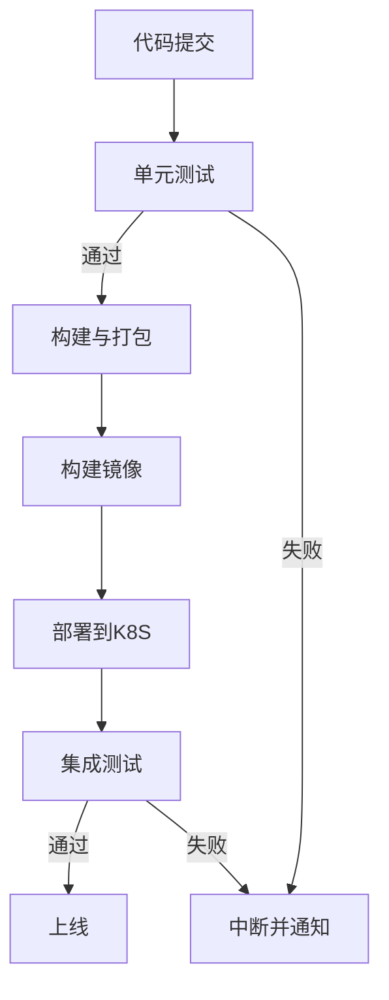

# 本地CI/CD流水线搭建与持续集成部署计划书

## 一、目标与背景

本计划书旨在指导如何在本地环境下，基于Docker Desktop自带的Kubernetes，搭建CI/CD流水线，实现“灵狐智验”软件工程基础课程系统的持续集成与部署。目标包括：
- 代码提交后自动进行单元测试、项目构建、容器化、部署到本地K8S。
- 前端、后端、数据库分别容器化，解耦部署。
- 流水线可选用Jenkins等工具容器化运行。
- 自动化集成测试，保障系统质量。

## 二、系统架构与分工

1. **前端**：独立容器，负责用户界面与交互。
2. **后端**：Spring Cloud微服务架构，每个服务单独容器。
3. **数据库**：如MySQL/PostgreSQL，单独容器。
4. **CI/CD流水线**：推荐Jenkins容器化，负责自动化流程。
5. **Kubernetes**：Docker Desktop自带K8S集群，负责容器编排与服务暴露。

## 三、实施步骤详解

### 步骤1: 环境准备
#### 1.1 安装必要软件
```bash
# 确保已安装：
# - Docker Desktop (启用Kubernetes)
# - Git
# - Maven 3.6+
# - Node.js 16+ (如有前端)
# - kubectl
```

#### 1.2 启用Docker Desktop Kubernetes
1. **打开Docker Desktop**
   - 在Windows任务栏右下角找到Docker图标并右键点击
   - 选择"Dashboard"打开Docker Desktop控制面板

2. **启用Kubernetes**
   - 点击右上角的设置图标（齿轮图标）
   - 在左侧菜单选择"Kubernetes"
   - 勾选"Enable Kubernetes"
   - 勾选"Show system containers (advanced)"（可选，用于查看系统容器）
   - 点击"Apply & Restart"
   - 等待Kubernetes启动（可能需要几分钟）

3. **验证安装**
   ```powershell
   # 在PowerShell中执行以下命令
   kubectl cluster-info
   kubectl get nodes
   kubectl get namespaces
   ```

4. **Docker Desktop中查看Kubernetes**
   - 在Docker Desktop Dashboard中，你可以看到"Kubernetes"标签页
   - 这里可以查看所有的Pods、Services、Deployments等资源

#### 1.3 在Windows中创建工作目录结构
```powershell
# 在PowerShell中执行
mkdir cicd-workspace
cd cicd-workspace
mkdir dockerfiles, k8s-manifests, scripts, tests

# 或者一行命令创建
mkdir cicd-workspace\dockerfiles, cicd-workspace\k8s-manifests, cicd-workspace\scripts, cicd-workspace\tests
cd cicd-workspace
```

#### 1.4 在Docker Desktop中管理容器和镜像
Docker Desktop提供了图形界面来管理容器和镜像：

**查看镜像**
- 打开Docker Desktop Dashboard
- 点击左侧"Images"标签
- 这里可以查看所有本地镜像，包括我们将要构建的`linghuzhiyan/*`镜像

**查看容器**
- 点击左侧"Containers"标签
- 可以查看所有运行中和停止的容器
- 每个容器都有启动/停止/删除按钮

**查看Kubernetes资源**
- 点击左侧"Kubernetes"标签
- 可以查看Pods、Services、Deployments等
- 支持直接在界面中删除资源

### 步骤2: 完善单元测试
#### 2.1 后端单元测试（Java SpringBoot）
在每个微服务模块的pom.xml中确保包含测试依赖：
```xml
<dependency>
    <groupId>org.springframework.boot</groupId>
    <artifactId>spring-boot-starter-test</artifactId>
    <scope>test</scope>
</dependency>
<dependency>
    <groupId>org.testcontainers</groupId>
    <artifactId>junit-jupiter</artifactId>
    <scope>test</scope>
</dependency>
```

#### 2.2 编写单元测试样例
为每个服务层、控制器层方法编写正反测试用例：
```java
// 示例：UserServiceTest.java
@ExtendWith(MockitoExtension.class)
class UserServiceTest {
    
    @Test
    void testCreateUser_Success() {
        // 正向测试用例
    }
    
    @Test
    void testCreateUser_InvalidInput() {
        // 反向测试用例
    }
}
```

#### 2.3 配置测试执行
在根pom.xml中配置surefire插件：
```xml
<plugin>
    <groupId>org.apache.maven.plugins</groupId>
    <artifactId>maven-surefire-plugin</artifactId>
    <configuration>
        <skipTests>false</skipTests>
    </configuration>
</plugin>
```

### 步骤3: 项目构建配置
#### 3.1 Maven构建配置
在根目录执行构建测试：
```bash
cd linghuzhiyan-micro
mvn clean compile
mvn test
mvn package -DskipTests=false
```

#### 3.2 创建构建脚本（Windows版本）
创建`scripts/build.ps1`（PowerShell脚本）：
```powershell
# build.ps1
Write-Host "开始构建项目..." -ForegroundColor Green
Set-Location ..\linghuzhiyan-micro

# 清理并编译
Write-Host "清理并编译..." -ForegroundColor Yellow
mvn clean compile

# 运行单元测试
Write-Host "执行单元测试..." -ForegroundColor Yellow
mvn test
if ($LASTEXITCODE -ne 0) {
    Write-Host "单元测试失败，停止构建" -ForegroundColor Red
    exit 1
}

# 打包
Write-Host "打包应用..." -ForegroundColor Yellow
mvn package -DskipTests=true

Write-Host "构建完成" -ForegroundColor Green
Set-Location ..\cicd-workspace
```

#### 3.3 在Docker Desktop中查看构建结果
构建完成后，你可以在Docker Desktop中：
1. **查看构建日志**：在PowerShell终端查看构建输出
2. **验证JAR包**：检查各微服务的`target`目录是否生成了JAR文件

### 步骤4: 容器化实现
#### 4.1 创建基础镜像Dockerfile
创建`dockerfiles/Dockerfile.backend`：
```dockerfile
FROM openjdk:21-jre-slim

# 设置工作目录
WORKDIR /app

# 复制jar包
COPY target/*.jar app.jar

# 暴露端口
EXPOSE 8080

# 健康检查
HEALTHCHECK --interval=30s --timeout=10s --start-period=60s \
  CMD curl -f http://localhost:8080/actuator/health || exit 1

# 启动应用
ENTRYPOINT ["java", "-jar", "app.jar"]
```

#### 4.2 创建数据库Dockerfile
创建`dockerfiles/Dockerfile.mysql`：
```dockerfile
FROM mysql:8.0

# 设置环境变量
ENV MYSQL_ROOT_PASSWORD=root123
ENV MYSQL_DATABASE=linghuzhiyan
ENV MYSQL_USER=app_user
ENV MYSQL_PASSWORD=app_pass

# 复制初始化脚本
COPY init.sql /docker-entrypoint-initdb.d/

# 暴露端口
EXPOSE 3306
```

#### 4.3 创建镜像构建脚本（Windows版本）
创建`scripts/build-images.ps1`：
```powershell
# build-images.ps1
Write-Host "开始构建Docker镜像..." -ForegroundColor Green

# 构建后端服务镜像
$services = @("user-service", "auth-service", "experiment-service", "gateway")

foreach ($service in $services) {
    Write-Host "构建 $service 镜像..." -ForegroundColor Yellow
    Set-Location "..\linghuzhiyan-micro\linghuzhiyan-$service"
    Copy-Item "..\..\cicd-workspace\dockerfiles\Dockerfile.backend" ".\Dockerfile"
    docker build -t "linghuzhiyan/$service`:latest" .
    Remove-Item ".\Dockerfile"
    Set-Location "..\..\cicd-workspace"
}

# 构建数据库镜像
Write-Host "构建数据库镜像..." -ForegroundColor Yellow
docker build -f dockerfiles\Dockerfile.mysql -t linghuzhiyan/mysql:latest .

Write-Host "镜像构建完成" -ForegroundColor Green
docker images | Select-String "linghuzhiyan"
```

#### 4.4 在Docker Desktop中查看构建的镜像
构建完成后：
1. **打开Docker Desktop Dashboard**
2. **点击"Images"标签**
3. **查找以"linghuzhiyan/"开头的镜像**
   - `linghuzhiyan/user-service:latest`
   - `linghuzhiyan/auth-service:latest`
   - `linghuzhiyan/experiment-service:latest`
   - `linghuzhiyan/gateway:latest`
   - `linghuzhiyan/mysql:latest`
4. **查看镜像详情**：点击镜像名称可以查看镜像大小、创建时间等信息
5. **运行测试容器**：可以点击"Run"按钮手动测试镜像是否正常

### 步骤5: Kubernetes部署配置
#### 5.1 创建命名空间
创建`k8s-manifests/namespace.yaml`：
```yaml
apiVersion: v1
kind: Namespace
metadata:
  name: linghuzhiyan
```

#### 5.2 创建数据库部署配置
创建`k8s-manifests/mysql-deployment.yaml`：
```yaml
apiVersion: apps/v1
kind: Deployment
metadata:
  name: mysql
  namespace: linghuzhiyan
spec:
  replicas: 1
  selector:
    matchLabels:
      app: mysql
  template:
    metadata:
      labels:
        app: mysql
    spec:
      containers:
      - name: mysql
        image: linghuzhiyan/mysql:latest
        ports:
        - containerPort: 3306
        env:
        - name: MYSQL_ROOT_PASSWORD
          value: "root123"
        volumeMounts:
        - name: mysql-storage
          mountPath: /var/lib/mysql
      volumes:
      - name: mysql-storage
        emptyDir: {}
---
apiVersion: v1
kind: Service
metadata:
  name: mysql-service
  namespace: linghuzhiyan
spec:
  selector:
    app: mysql
  ports:
  - port: 3306
    targetPort: 3306
  type: ClusterIP
```

#### 5.3 创建后端服务部署模板
创建`k8s-manifests/backend-service-template.yaml`：
```yaml
apiVersion: apps/v1
kind: Deployment
metadata:
  name: SERVICE_NAME
  namespace: linghuzhiyan
spec:
  replicas: 1
  selector:
    matchLabels:
      app: SERVICE_NAME
  template:
    metadata:
      labels:
        app: SERVICE_NAME
    spec:
      containers:
      - name: SERVICE_NAME
        image: linghuzhiyan/SERVICE_NAME:latest
        ports:
        - containerPort: 8080
        env:
        - name: SPRING_PROFILES_ACTIVE
          value: "docker"
        - name: MYSQL_HOST
          value: "mysql-service"
---
apiVersion: v1
kind: Service
metadata:
  name: SERVICE_NAME-service
  namespace: linghuzhiyan
spec:
  selector:
    app: SERVICE_NAME
  ports:
  - port: 8080
    targetPort: 8080
  type: ClusterIP
```

#### 5.4 创建部署脚本（Windows版本）
创建`scripts/deploy-k8s.ps1`：
```powershell
# deploy-k8s.ps1
Write-Host "开始部署到Kubernetes..." -ForegroundColor Green

# 创建命名空间
Write-Host "创建命名空间..." -ForegroundColor Yellow
kubectl apply -f k8s-manifests\namespace.yaml

# 部署数据库
Write-Host "部署数据库..." -ForegroundColor Yellow
kubectl apply -f k8s-manifests\mysql-deployment.yaml

# 等待数据库就绪
Write-Host "等待数据库就绪..." -ForegroundColor Yellow
kubectl wait --for=condition=available --timeout=300s deployment/mysql -n linghuzhiyan

# 部署后端服务
$services = @("user-service", "auth-service", "experiment-service", "gateway")

foreach ($service in $services) {
    Write-Host "部署 $service..." -ForegroundColor Yellow
    (Get-Content k8s-manifests\backend-service-template.yaml) -replace 'SERVICE_NAME', $service | 
        Set-Content "k8s-manifests\$service-deployment.yaml"
    kubectl apply -f "k8s-manifests\$service-deployment.yaml"
}

# 检查部署状态
Write-Host "检查部署状态..." -ForegroundColor Yellow
kubectl get pods -n linghuzhiyan
kubectl get services -n linghuzhiyan

Write-Host "部署完成" -ForegroundColor Green
```

#### 5.5 在Docker Desktop中查看Kubernetes部署
部署完成后，在Docker Desktop中查看：

1. **打开Docker Desktop Dashboard**
2. **点击"Kubernetes"标签**
3. **查看部署的资源**：
   - **Pods**：显示所有运行的Pod，包括MySQL和各个微服务
   - **Services**：显示服务发现和负载均衡配置
   - **Deployments**：显示部署配置和副本数量

4. **监控Pod状态**：
   - 绿色圆点：Pod运行正常
   - 红色圆点：Pod有问题
   - 黄色圆点：Pod正在启动

5. **查看Pod日志**：
   - 点击具体的Pod名称
   - 点击"Logs"按钮查看实时日志
   - 这对调试非常有用

6. **端口转发测试**：
   - 选择gateway-service
   - 点击"Port forwarding"
   - 设置本地端口8080映射到容器8080端口
   - 然后可以通过`http://localhost:8080`访问服务

### 步骤6: CI/CD流水线搭建
#### 6.1 使用Jenkins（推荐）
##### 6.1.1 部署Jenkins到K8S
创建`k8s-manifests/jenkins-deployment.yaml`：
```yaml
apiVersion: apps/v1
kind: Deployment
metadata:
  name: jenkins
  namespace: linghuzhiyan
spec:
  replicas: 1
  selector:
    matchLabels:
      app: jenkins
  template:
    metadata:
      labels:
        app: jenkins
    spec:
      containers:
      - name: jenkins
        image: jenkins/jenkins:lts
        ports:
        - containerPort: 8080
        - containerPort: 50000
        volumeMounts:
        - name: jenkins-home
          mountPath: /var/jenkins_home
        - name: docker-sock
          mountPath: /var/run/docker.sock
      volumes:
      - name: jenkins-home
        emptyDir: {}
      - name: docker-sock
        hostPath:
          path: /var/run/docker.sock
---
apiVersion: v1
kind: Service
metadata:
  name: jenkins-service
  namespace: linghuzhiyan
spec:
  selector:
    app: jenkins
  ports:
  - name: web
    port: 8080
    targetPort: 8080
    nodePort: 30080
  - name: agent
    port: 50000
    targetPort: 50000
  type: NodePort
```

##### 6.1.2 创建Jenkinsfile
在项目根目录创建`Jenkinsfile`：
```groovy
pipeline {
    agent any
    
    stages {
        stage('代码检出') {
            steps {
                checkout scm
            }
        }
        
        stage('单元测试') {
            steps {
                dir('linghuzhiyan-micro') {
                    sh 'mvn clean test'
                }
            }
            post {
                always {
                    publishTestResults testResultsPattern: '**/target/surefire-reports/*.xml'
                }
            }
        }
        
        stage('构建打包') {
            steps {
                dir('linghuzhiyan-micro') {
                    sh 'mvn package -DskipTests=true'
                }
            }
        }
        
        stage('构建镜像') {
            steps {
                sh './cicd-workspace/scripts/build-images.sh'
            }
        }
        
        stage('部署到K8S') {
            steps {
                sh './cicd-workspace/scripts/deploy-k8s.sh'
            }
        }
        
        stage('集成测试') {
            steps {
                sh './cicd-workspace/scripts/integration-test.sh'
            }
        }
    }
    
    post {
        failure {
            echo '流水线执行失败！'
        }
        success {
            echo '流水线执行成功！'
        }
    }
}
```

#### 6.2 简化版本：使用PowerShell脚本
创建`scripts/ci-cd-pipeline.ps1`：
```powershell
# ci-cd-pipeline.ps1
$ErrorActionPreference = "Stop"

Write-Host "========== CI/CD流水线开始 ==========" -ForegroundColor Green

try {
    # 1. 单元测试
    Write-Host "步骤1: 执行单元测试" -ForegroundColor Cyan
    .\build.ps1

    # 2. 构建镜像
    Write-Host "步骤2: 构建Docker镜像" -ForegroundColor Cyan
    .\build-images.ps1

    # 3. 部署到K8S
    Write-Host "步骤3: 部署到Kubernetes" -ForegroundColor Cyan
    .\deploy-k8s.ps1

    # 4. 集成测试
    Write-Host "步骤4: 执行集成测试" -ForegroundColor Cyan
    .\integration-test.ps1

    Write-Host "========== CI/CD流水线完成 ==========" -ForegroundColor Green
}
catch {
    Write-Host "流水线执行失败: $($_.Exception.Message)" -ForegroundColor Red
    exit 1
}
```

#### 6.3 在Docker Desktop中监控Jenkins
如果选择使用Jenkins，部署后在Docker Desktop中：

1. **查看Jenkins Pod**：
   - 在Kubernetes标签页找到jenkins Pod
   - 确保状态为Running

2. **访问Jenkins界面**：
   - 使用端口转发：`kubectl port-forward service/jenkins-service 8080:8080 -n linghuzhiyan`
   - 或者在Docker Desktop中设置端口转发
   - 打开浏览器访问`http://localhost:30080`（NodePort）

3. **获取Jenkins初始密码**：
   ```powershell
   kubectl logs deployment/jenkins -n linghuzhiyan | Select-String "password"
   ```

4. **配置Jenkins**：
   - 安装推荐插件
   - 创建管理员用户
   - 配置Docker和kubectl访问权限

### 步骤7: 集成测试实现
#### 7.1 创建集成测试脚本（Windows版本）
创建`scripts/integration-test.ps1`：
```powershell
# integration-test.ps1
Write-Host "开始集成测试..." -ForegroundColor Green

# 等待服务启动
Write-Host "等待服务启动..." -ForegroundColor Yellow
Start-Sleep 60

# 获取Gateway服务地址
$gatewayIP = kubectl get service gateway-service -n linghuzhiyan -o jsonpath='{.spec.clusterIP}'
$gatewayURL = "http://$gatewayIP:8080"

Write-Host "Gateway URL: $gatewayURL" -ForegroundColor Yellow

# 执行API测试
Write-Host "执行API健康检查..." -ForegroundColor Yellow
try {
    $response = Invoke-WebRequest -Uri "$gatewayURL/actuator/health" -UseBasicParsing
    Write-Host "健康检查通过: $($response.StatusCode)" -ForegroundColor Green
}
catch {
    Write-Host "健康检查失败: $($_.Exception.Message)" -ForegroundColor Red
    exit 1
}

# 使用Newman执行Postman集合（如果有）
$postmanCollection = "..\linghuzhiyan-micro\api-tests.postman_collection.json"
if (Test-Path $postmanCollection) {
    Write-Host "执行Postman集成测试..." -ForegroundColor Yellow
    npx newman run $postmanCollection --env-var "base_url=$gatewayURL"
}

Write-Host "集成测试完成" -ForegroundColor Green
```

#### 7.2 创建Postman测试集合
更新现有的`api-tests.postman_collection.json`，添加基础健康检查测试。

### 步骤8: 执行完整流水线
#### 8.1 设置PowerShell执行策略
```powershell
# 允许执行PowerShell脚本（仅在当前会话中）
Set-ExecutionPolicy -ExecutionPolicy RemoteSigned -Scope CurrentUser

# 或者为每个脚本单独允许
Unblock-File .\scripts\*.ps1
```

#### 8.2 执行流水线
```powershell
# 进入工作目录
cd cicd-workspace\scripts

# 方式1：执行完整流水线
.\ci-cd-pipeline.ps1

# 方式2：分步执行
.\build.ps1
.\build-images.ps1
.\deploy-k8s.ps1
.\integration-test.ps1
```

#### 8.3 在Docker Desktop中监控和验证
部署完成后，在Docker Desktop中进行全面验证：

**1. 查看所有运行的容器**
- 打开Docker Desktop Dashboard
- 点击"Containers"标签
- 确保所有相关容器都在运行

**2. 查看Kubernetes资源**
- 点击"Kubernetes"标签
- 检查所有Pod状态（应该都是绿色）
- 查看Services配置是否正确

**3. 实时日志监控**
```powershell
# 查看所有Pod状态
kubectl get pods -n linghuzhiyan

# 查看特定服务日志
kubectl logs -f deployment/gateway -n linghuzhiyan
kubectl logs -f deployment/mysql -n linghuzhiyan

# 查看所有服务状态
kubectl get services -n linghuzhiyan
```

**4. 端口转发测试**
在Docker Desktop中或使用命令：
```powershell
# 端口转发Gateway服务
kubectl port-forward service/gateway-service 8080:8080 -n linghuzhiyan

# 然后在浏览器中访问
Start-Process "http://localhost:8080/actuator/health"
```

**5. 清理资源（可选）**
```powershell
# 删除整个命名空间（包含所有资源）
kubectl delete namespace linghuzhiyan

# 删除本地镜像
docker rmi $(docker images "linghuzhiyan/*" -q)
```

#### 8.4 故障排查
如果遇到问题，在Docker Desktop中：

**查看Pod详情**
- 点击有问题的Pod
- 查看"Events"了解启动问题
- 查看"Logs"了解运行时错误

**查看资源使用情况**
- 在Docker Desktop中查看CPU和内存使用
- 确保资源充足

**重启服务**
```powershell
# 重启特定部署
kubectl rollout restart deployment/gateway -n linghuzhiyan

# 删除并重新创建Pod
kubectl delete pod -l app=gateway -n linghuzhiyan
```

## 四、工具与环境要求
- Docker Desktop（含Kubernetes）
- Jenkins（推荐容器化）
- Maven/Gradle、npm/yarn
- kubectl
- Postman或自动化测试工具

## 五、交付物
- 完整的CI/CD流水线脚本（如Jenkinsfile）
- 各服务Dockerfile、K8S部署YAML
- 单元测试与集成测试用例
- 本计划书及相关文档

## 六、注意事项
- 保证每次构建均自动执行所有单元测试。
- 流水线失败时应有日志与通知。
- 数据库数据初始化与持久化需考虑。
- 端口、服务名、环境变量等需统一规范。

## 七、参考流程图



---
如需详细脚本与配置示例，请参考项目docs目录下相关文件。
